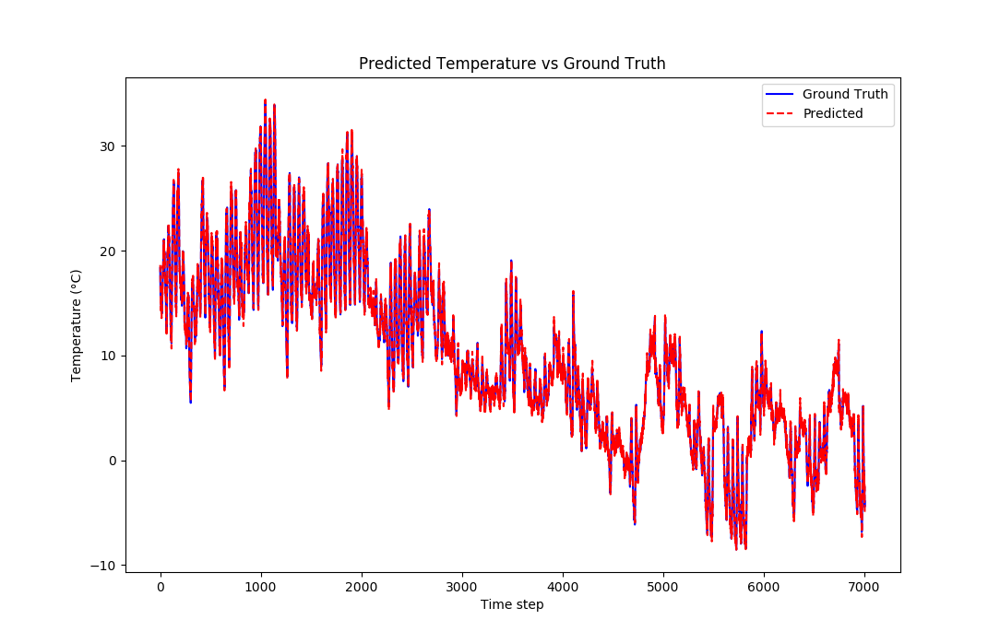

# Ridge Regression for Time-Series Forecasting

This repository contains my NumPy implementation of ridge regression for univariate time-series prediction using three solvers:

* **Closed-form (normal equations)**
* **Cholesky decomposition**
* **Conjugate Gradient (CG)**

## Repo structure

```
.
├─ src/
│  ├─ linear_regression.py
│  ├─ linear_regression_cholesky.py
│  ├─ linear_regression_just_closed.py
│  └─ linear_regression_just_cg.py
├─ reports/
│  └─ figures/
│     ├─ closed_form.png
│     ├─ Cholesky.png
│     ├─ Congugate gradient.png
│     ├─ closed_form time.JPG
│     ├─ Cholesky time.JPG
│     └─ CG times.JPG
├─ requirements.txt
├─ .gitignore
└─ LICENSE
```

> **Note:** The dataset is **not included** in the repository. See **Data (not included)** below.

## Environment

* Python **3.10**
* Install dependencies:

  ```bash
  pip install -r requirements.txt
  ```

## Data (not included)

The code expects two CSV files—**one numeric column** each (temperatures in °C), no datetime column required:

```
train_series.csv   # training split
test_series.csv    # holdout split
```

Place these files at the project root **or** update the paths in `src/*.py` to point to your local copies.
If your CSV has multiple columns, the scripts use the **first** column as the series (you can adjust the loader line accordingly).

**Why excluded?** To keep the repo lightweight and respect potential data-sharing constraints. If you’d like to reproduce exactly, use similarly formatted CSVs or your own series.

## How to run

From the repository root:

```bash
# all solvers together (and plotting)
python src/linear_regression.py

# or run a specific solver:
python src/linear_regression_just_closed.py
python src/linear_regression_cholesky.py
python src/linear_regression_just_cg.py
```

Each script prints metrics (train/test MSE, timing) and renders a prediction vs. ground-truth plot.

## Results (from my runs)

**Test MSE & wall-clock training time:**

* **Conjugate Gradient:** MSE ≈ **0.2456**, time ≈ **1063.92 s**
* **Cholesky:** MSE ≈ **0.2653**, time ≈ **1075.10 s**
* **Closed-form:** MSE ≈ **0.2653**, time ≈ **2586.57 s**

**Prediction overlays:**

* CG: 
* Cholesky: 
* Closed-form: 

**Timing screenshots:**

* CG: 
* Cholesky: 
* Closed-form: 

**Discussion (brief).** All three methods closely track the signal. CG achieves the lowest test error and is substantially faster than the closed-form solve, with Cholesky matching closed-form accuracy at lower runtime.

## Reproducibility tips

* Keep CSVs in the same folder as the scripts or adjust the file paths at the top of each script.
* Use the provided `requirements.txt` (NumPy, Matplotlib). No ML frameworks required.
* For large datasets, consider a small sample for quick local checks and full runs offline.

## License

MIT — see `LICENSE`.
